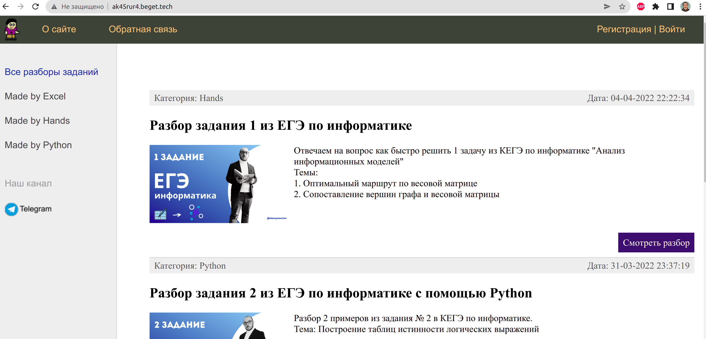
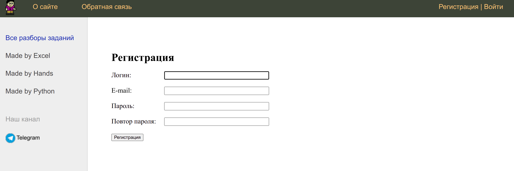
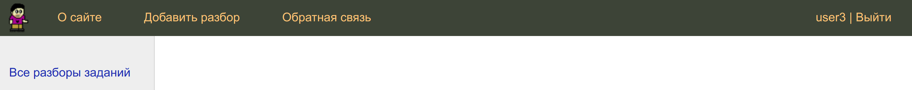
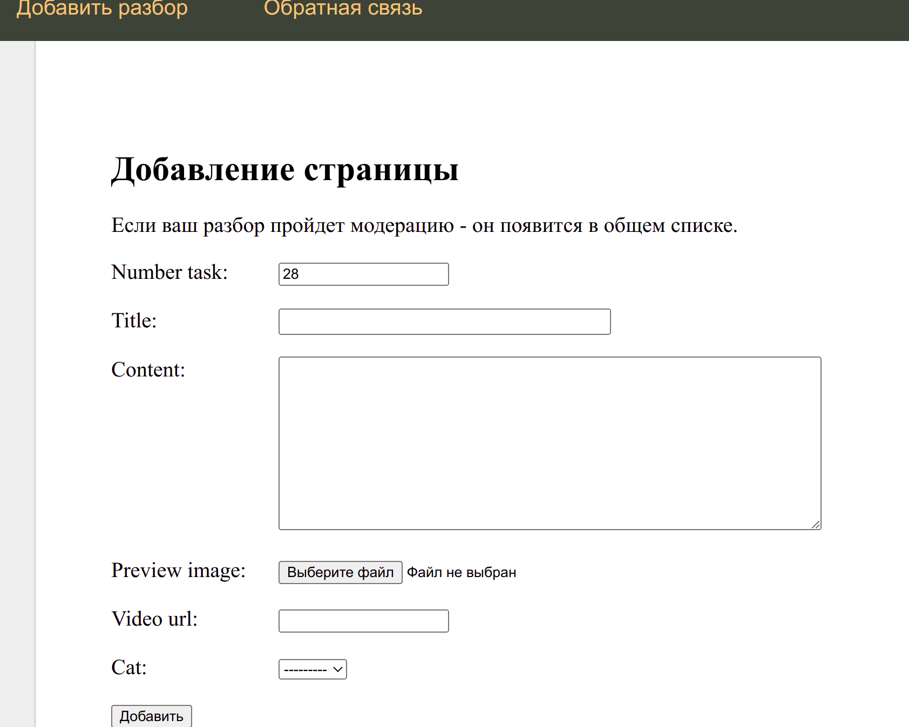

# Teacher EGE site
Django сайт, созданный для обучения основам фреймворка. Может использован как заготовка для учительского блога.

# Настроена регистрация и авторизация

# Авторизованный пользователь может добавлять свои записи.

После добавления запись поступает на модерацию и только потом появляется на сайте.

# Деплой
Сайт для тренировки был размещен на http://ak45rur4.beget.tech/ Где его можно посмотреть до 5 мая.
В проекте использована БД SQLite, которая в деплое была переделана под MySQL

# Благодарность
Выражаю благодарность https://github.com/selfedu-rus за шикарные уроки на YouTube. Оформление было также заимствовано у этого автора.